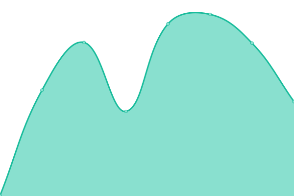
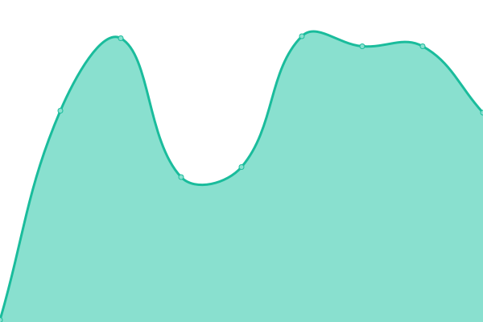

# [📈 Live Status](https://serie-a-logistics-solutions.github.io/upptime_test): <!--live status--> **🟧 Partial outage**

This repository contains the open-source uptime monitor and status page for [serie a logistics solutions AG](https://www.nx3.io/), powered by [Upptime](https://github.com/upptime/upptime).

With [Upptime](https://upptime.js.org), you can get your own unlimited and free uptime monitor and status page, powered entirely by a GitHub repository. We use [Issues](https://github.com/serie-a-logistics-solutions/upptime_test/issues) as incident reports, [Actions](https://github.com/serie-a-logistics-solutions/upptime_test/actions) as uptime monitors, and [Pages](https://serie-a-logistics-solutions.github.io/upptime_test) for the status page.

<!--start: status pages-->
<!-- This summary is generated by Upptime (https://github.com/upptime/upptime) -->
<!-- Do not edit this manually, your changes will be overwritten -->
<!-- prettier-ignore -->
| URL | Status | History | Response Time | Uptime |
| --- | ------ | ------- | ------------- | ------ |
|  [Node 1 - IAM Service](https://transport-demo.on.nx3.cloud/monitoring/node1/auth/auth/health/live) | 🟥 Down | [node-1-iam-service.yml](https://github.com/serie-a-logistics-solutions/nx3_demo_status/commits/HEAD/history/node-1-iam-service.yml) | 

 0ms
     
 | 

<a href="https://serie-a-logistics-solutions.github.io/nx3_demo_status/history/node-1-iam-service">0.00%</a>
    

|  [Node 2 - IAM Service](https://transport-demo.on.nx3.cloud/monitoring/node2/auth/auth/health/live) | 🟥 Down | [node-2-iam-service.yml](https://github.com/serie-a-logistics-solutions/nx3_demo_status/commits/HEAD/history/node-2-iam-service.yml) | 

 0ms
     
 | 

<a href="https://serie-a-logistics-solutions.github.io/nx3_demo_status/history/node-2-iam-service">0.00%</a>
    

|  [Node 1 - Backoffice Service](https://transport-demo.on.nx3.cloud/monitoring/node1/rs/actuator/health) | 🟥 Down | [node-1-backoffice-service.yml](https://github.com/serie-a-logistics-solutions/nx3_demo_status/commits/HEAD/history/node-1-backoffice-service.yml) | 

 0ms
     
 | 

<a href="https://serie-a-logistics-solutions.github.io/nx3_demo_status/history/node-1-backoffice-service">0.00%</a>
    

|  [Node 2 - Backoffice Service](https://transport-demo.on.nx3.cloud/monitoring/node2/rs/actuator/health) | 🟥 Down | [node-2-backoffice-service.yml](https://github.com/serie-a-logistics-solutions/nx3_demo_status/commits/HEAD/history/node-2-backoffice-service.yml) | 

 0ms
     
 | 

<a href="https://serie-a-logistics-solutions.github.io/nx3_demo_status/history/node-2-backoffice-service">0.00%</a>
    

|  [Database Service](https://transport-demo.on.nx3.cloud/monitoring/node1/rs/actuator/health) | 🟥 Down | [database-service.yml](https://github.com/serie-a-logistics-solutions/nx3_demo_status/commits/HEAD/history/database-service.yml) | 

 0ms
     
 | 

<a href="https://serie-a-logistics-solutions.github.io/nx3_demo_status/history/database-service">0.00%</a>
    

|  [Monitoring](https://transport-demo.kb.eu-west-1.aws.found.io/login?next=%2Fapp%2Fhome#/) | 🟩 Up | [monitoring.yml](https://github.com/serie-a-logistics-solutions/nx3_demo_status/commits/HEAD/history/monitoring.yml) | 

 550ms
     
 | 

<a href="https://serie-a-logistics-solutions.github.io/nx3_demo_status/history/monitoring">100.00%</a>
    

|  [EU-Licence-Classification Service](https://eulicence-classification.nx3-services.cloud/api/health_check) | 🟥 Down | [eu-licence-classification-service.yml](https://github.com/serie-a-logistics-solutions/nx3_demo_status/commits/HEAD/history/eu-licence-classification-service.yml) | 

 0ms
     
 | 

<a href="https://serie-a-logistics-solutions.github.io/nx3_demo_status/history/eu-licence-classification-service">0.00%</a>
    

<!--end: status pages-->

[**Visit our status website →**](https://serie-a-logistics-solutions.github.io/upptime_test)

## 📄 License

- Powered by: [Upptime](https://github.com/upptime/upptime)
- Code: [MIT](./LICENSE) © [serie a logistics solutions AG](https://www.nx3.io/)
- Data in the `./history` directory: [Open Database License](https://opendatacommons.org/licenses/odbl/1-0/)
