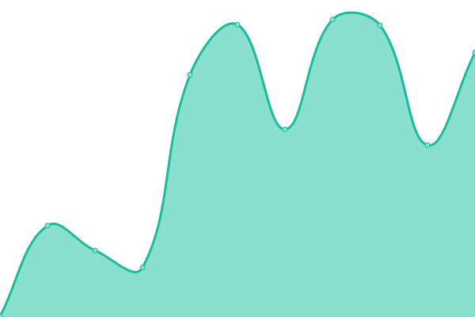

# [📈 Live Status](https://serie-a-logistics-solutions.github.io/upptime_test): <!--live status--> **🟩 All systems operational**

This repository contains the open-source uptime monitor and status page for [serie a logistics solutions AG](https://www.nx3.io/), powered by [Upptime](https://github.com/upptime/upptime).

With [Upptime](https://upptime.js.org), you can get your own unlimited and free uptime monitor and status page, powered entirely by a GitHub repository. We use [Issues](https://github.com/serie-a-logistics-solutions/upptime_test/issues) as incident reports, [Actions](https://github.com/serie-a-logistics-solutions/upptime_test/actions) as uptime monitors, and [Pages](https://serie-a-logistics-solutions.github.io/upptime_test) for the status page.

<!--start: status pages-->
<!-- This summary is generated by Upptime (https://github.com/upptime/upptime) -->
<!-- Do not edit this manually, your changes will be overwritten -->
<!-- prettier-ignore -->
| URL | Status | History | Response Time | Uptime |
| --- | ------ | ------- | ------------- | ------ |
|  [Keycloak](https://backoffice-transport-demo.on.nx3.cloud/auth/) | 🟩 Up | [keycloak.yml](https://github.com/serie-a-logistics-solutions/nx3_demo_status/commits/HEAD/history/keycloak.yml) | 

 481ms
     
 | 

<a href="https://serie-a-logistics-solutions.github.io/nx3_demo_status/history/keycloak">100.00%</a>
    

|  [elasticsearch](https://backoffice-transport-demo.on.nx3.cloud/auth/) | 🟩 Up | [elasticsearch.yml](https://github.com/serie-a-logistics-solutions/nx3_demo_status/commits/HEAD/history/elasticsearch.yml) | 

 144ms
     
 | 

<a href="https://serie-a-logistics-solutions.github.io/nx3_demo_status/history/elasticsearch">100.00%</a>
    

|  [App-Knoten 1](https://transport-demo.on.nx3.cloud/) | 🟩 Up | [app-knoten-1.yml](https://github.com/serie-a-logistics-solutions/nx3_demo_status/commits/HEAD/history/app-knoten-1.yml) | 

 507ms
     
 | 

<a href="https://serie-a-logistics-solutions.github.io/nx3_demo_status/history/app-knoten-1">100.00%</a>
    

|  [App-Knoten 2](https://transport-demo.on.nx3.cloud/) | 🟩 Up | [app-knoten-2.yml](https://github.com/serie-a-logistics-solutions/nx3_demo_status/commits/HEAD/history/app-knoten-2.yml) | 

 138ms
     
 | 

<a href="https://serie-a-logistics-solutions.github.io/nx3_demo_status/history/app-knoten-2">100.00%</a>
    

<!--end: status pages-->

[**Visit our status website →**](https://serie-a-logistics-solutions.github.io/upptime_test)

## 📄 License

- Powered by: [Upptime](https://github.com/upptime/upptime)
- Code: [MIT](./LICENSE) © [serie a logistics solutions AG](https://www.nx3.io/)
- Data in the `./history` directory: [Open Database License](https://opendatacommons.org/licenses/odbl/1-0/)
